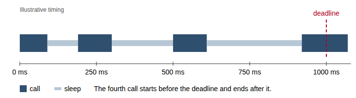

<!-- ex:id overview -->
# This retry loop stops at a deadline, not after a count

<!-- ex:id p_claim -->
The loop below retries a failing call with growing delays, but it stops on
time, not on an attempt count. Before each sleep it checks whether the sleep
would pass the deadline; if so, it gives up and raises the last error. The
caller therefore gets an answer within the deadline plus the duration of one
call.

<!-- ex:id p_why -->
A count-based limit answers the wrong question. Five attempts can take a
second or a minute depending on the delays and on how long each failing call
takes. A caller with its own timeout cares about elapsed time, so the loop
measures elapsed time.

<!-- ex:id q_requirement -->
> The caller must receive either a result or an error within its own time
> budget; it does not care how many attempts were made.

<!-- ex:id t_budget -->
| Limit | What it bounds | What it leaves unbounded |
|---|---|---|
| Attempt count | Number of calls | Total elapsed time |
| Deadline | Elapsed time before the last attempt starts | Duration of that last attempt |

<!-- ex:id p_overrun -->
The bound is not exact. The deadline check happens before sleeping, not
during the call, so one slow call can run past the deadline. If the caller
needs a hard bound, the call itself must accept a timeout.

<!-- ex:id fig_overrun -->



The deadline test is the only exit besides success.


Checking before the sleep avoids waking up only to discover that no time is
left for another attempt.



The cap keeps late attempts from waiting longer than the remaining budget is
likely to allow.




```python
import time


def call_with_retries(call, deadline_s, first_delay_s=0.1, max_delay_s=2.0):
    start = time.monotonic()
    delay = first_delay_s
    while True:
        try:
            return call()
        except Exception:
            if time.monotonic() - start + delay > deadline_s:
                raise
            time.sleep(delay)
            delay = min(delay * 2, max_delay_s)
```


<!-- ex:id p_usage -->
A caller passes its own budget and a zero-argument callable:

<!-- ex:id c_usage -->
```python
profile = call_with_retries(lambda: fetch_profile(user_id), deadline_s=1.5)
```


Production retry loops usually randomize each delay so that many clients do not
retry in lockstep. The example leaves jitter out to keep the deadline logic
visible; adding it does not change where the loop exits.


<!-- ex:id p_use -->
Use a count limit only when each attempt has a real cost, such as a paid
request. Otherwise, a deadline expresses what the caller needs.
