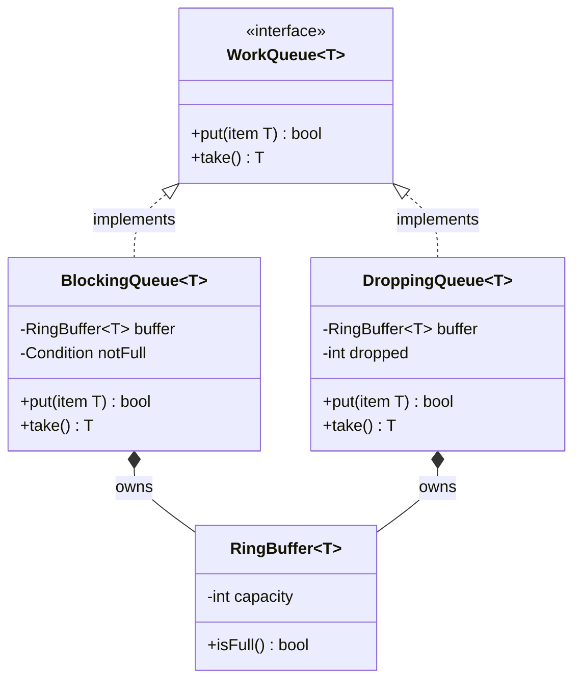

<!-- ex:id overview -->
# Two queue classes share one interface but differ on a full queue

<!-- ex:id p_claim -->
Both classes implement the same `WorkQueue` interface, so a caller can hold
either one through the interface. They differ in one method: when the buffer is
full, `BlockingQueue.put` waits, while `DroppingQueue.put` returns `false` and
discards the item.


The interface fixes the method names; each class owns the full-buffer policy.
Both classes hold their items in a `RingBuffer`.



<!-- ex:id p_limits -->
This is an illustrative design, not a description of a particular library. A
class diagram shows structure, not timing: it does not show how long
`BlockingQueue.put` can wait, or that `take` also waits on an empty buffer.
