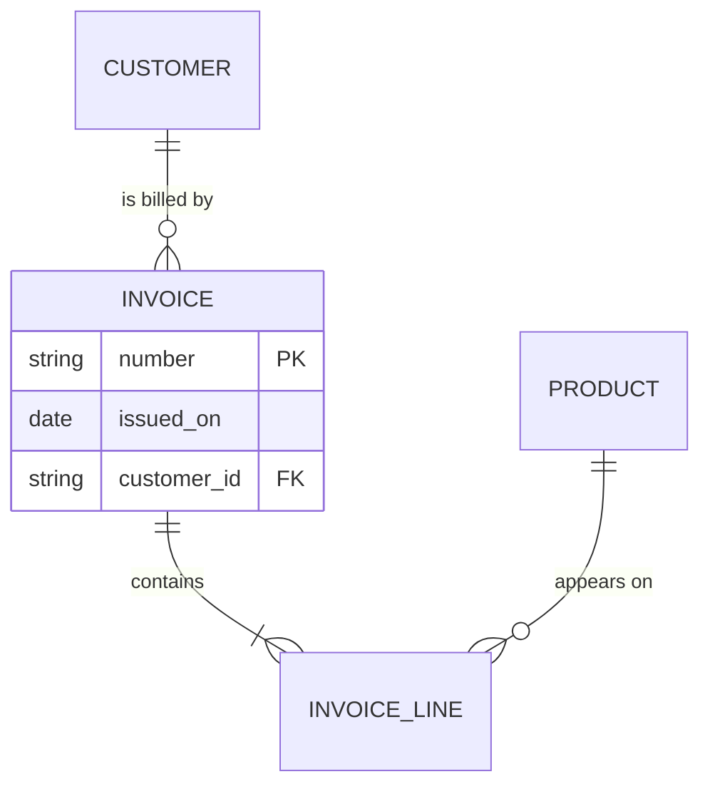

<!-- vs:id bill_overview -->
# An invoice line belongs to exactly one invoice and one product

<!-- vs:id bill_claim -->
Invoice totals are not stored; they are the sum of the invoice's lines. Each
line refers to one product. If a line read the product's current price, a price
change would silently alter old invoices, so each line must store the unit
price it was billed at.

<!-- vs:id bill_limits -->
This is an illustrative schema. The diagram is shown as one figure: its
entities and relationships are not individually inspectable, and the source
text below the drawing states them exactly.


A customer can exist without invoices, and a product without invoice lines; an
invoice line cannot exist without both.


