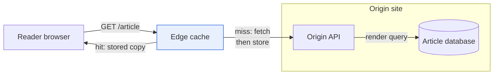

<!-- ex:id cdn_overview -->
# An edge cache answers most reads without reaching the origin

<!-- ex:id cdn_claim -->
A reader's request stops at the edge cache when the cache holds a fresh copy of
the article. Only a miss travels to the origin, and only the origin queries the
database. The load on the database therefore follows the miss rate, not the
reader count.

<!-- ex:id cdn_limits -->
This is an illustrative site, not a measured one. It ignores revalidation,
private responses, and cache eviction; each of those adds requests to the
origin.


The labelled arrow `miss_fetch` is the only path from the edge to the origin
site.



<!-- ex:id cdn_cost -->
A miss costs one origin render and one database query, and the edge stores the
result for the next reader. A burst of readers who all miss at the same moment
would still reach the origin together; request coalescing at the edge is the
usual remedy, and it is not shown here.
