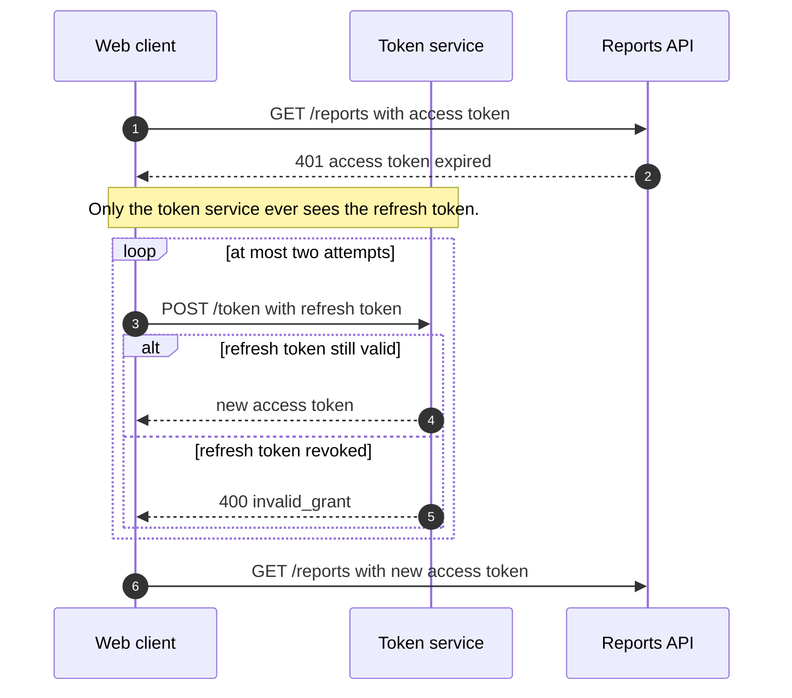

<!-- ex:id tok_overview -->
# An expired access token costs one extra round trip, not a new login

<!-- ex:id tok_claim -->
When the reports API rejects an expired access token, the client asks the
token service for a new one with its refresh token and repeats the original
request. The user sees a slower response, not a login page, unless the refresh
token itself was revoked.

<!-- ex:id tok_limits -->
This is an illustrative client. It does not show token storage, clock skew, or
several tabs refreshing at the same time.


The loop runs at most twice; the alternative shows the two answers the token
service can give.



<!-- ex:id tok_revoked -->
After `invalid_grant`, retrying cannot help: the client must start a new login.
Retrying on that answer only adds load to the token service.
