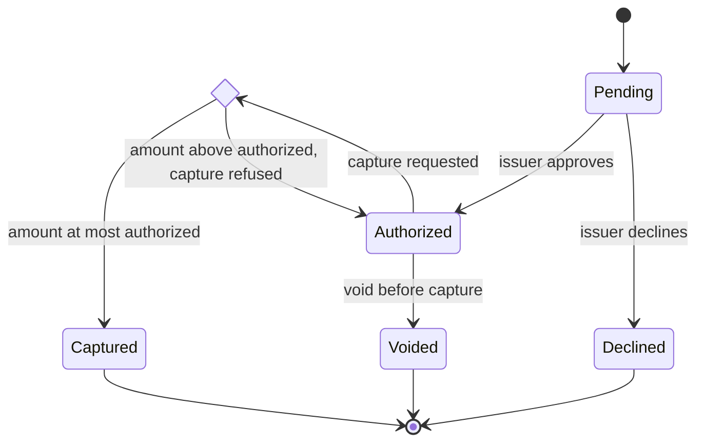

<!-- vs:id pay_overview -->
# A card payment is captured only after an explicit amount check

<!-- vs:id pay_claim -->
Authorization reserves an amount; capture moves money. Between the two, the
service checks the requested capture amount against the authorized amount. A
capture above the authorized amount is refused, and the payment stays
authorized rather than failing.

<!-- vs:id pay_limits -->
This is an illustrative lifecycle. Real card networks add partial captures,
authorization expiry, and refunds, which are not shown.


Captured, Declined, and Voided are final. The diamond is a decision, not a
state that a payment waits in.



<!-- vs:id pay_void -->
A void is possible only from Authorized. Once a payment is captured, returning
money is a refund, which is a separate payment in this design.
