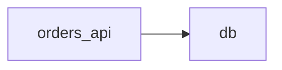
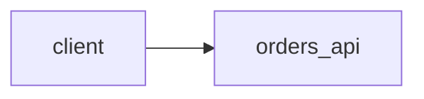

<!-- ex:id overview -->
# Mermaid fixture


The client waits only for the API.

```mermaid
flowchart LR
  orders_api --> db
```



The client waits only for the API.

```mermaid
flowchart LR
  client --> orders_api
```

