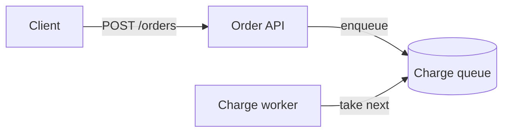

# Mermaid diagram — `mermaid`

**Question:** Does a diagram type that the catalogue lacks, or a quick familiar flow, answer the reader's question?

## Use it when

- The diagram type is not in the catalogue: ER, class, Gantt, and others.
- A quick flow or sequence is enough, and the reader does not need evidence
  for each edge.
- The reader already knows Mermaid notation, and familiarity helps.

## Do not use it when

- The reader must inspect each relationship with its evidence. Use a catalogue
  family such as `architecture` or `trace`.
- The figure must be byte-identical between builds. Mermaid renders in the browser.
- You need composite or concurrent states. Split the diagram, or use `state`.

## Misleading example

**Reject:** a flowchart with unlabelled arrows for a request path, where the
reader must guess which arrow is a call and which is a reply.

**Prefer:** label each arrow (`-->|enqueue|`), use distinctive node names
such as `orders_api`, and give an edge an ID (`e1@-->`) if a reader must
reference it.

## Tags and attributes

| Tag | Required | Optional |
|---|---|---|
| `mermaid` | `id`, `title`, `question` | — |

## Rules

- The tag holds an optional interpretation paragraph, then exactly one
  fence with the language `mermaid`. Nothing else.
- Flowchart, `stateDiagram-v2`, and sequence diagrams are parsed at build time.
  Each node, subgraph, state, and participant becomes a target. Its ID is the
  Mermaid name in lowercase with `.` changed to `_`.
- Target IDs are document-wide. A Mermaid name that maps to an ID in use,
  also in another Mermaid figure, is `E_ID_DUPLICATE`.
- Other diagram types are one figure-level target.
- A target inside the fence is edited through its figure: replace the whole
  `mermaid` block.
- The toolkit sets all configuration. These are `E_UNSAFE_CONTENT`: `%%{`
  directives, frontmatter (`---`) in the fence, `click`, `href`, `call`,
  `callback`, `link`, and `links` statements, HTML in labels other than
  `<br>`, `url(`, the `img:` and `icon:` shape attributes, and style
  declarations other than plain colours, widths, and font styles.
- A `%%` comment must be on its own line. Output does not show it.
- An entity code such as `#quot;` is `E_SEMANTIC`. Write the character.

## Narrow screens and text

The page shows the Mermaid source as text before the drawing loads, and
without JavaScript. The Markdown projection keeps the source, without comments.

## Template

````markdown explain-template

The client waits only for the API; the worker runs later.



````

## Diagnostics

- `E_UNSAFE_CONTENT`: a rejected statement or directive. Remove it.
- `E_ID_DUPLICATE`: a Mermaid name collides with another ID. Rename the node.
- `E_SEMANTIC`: composite states, an entity code, or a name outside the ID grammar.
