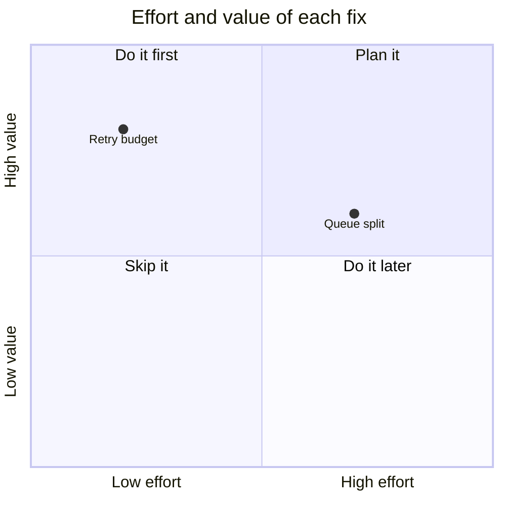

# Mermaid (escape hatch) — `mermaid`

**Question:** Is there no native component for this, and does the reader accept a figure without inspectable parts?

**Confused with:** `architecture` and `transform` (a flowchart), `trace` (a sequence diagram), `state` (a state diagram), and `domain` (an ER or class diagram).

Mermaid is an escape hatch, not a catalogue answer. `visser check --review`
gives one `W_MERMAID` prompt for each Mermaid figure.

## Use it when

- No native component draws the diagram type. Examples are a pie, a mind
  map, and a quadrant chart.
- The reader accepts a figure whose parts they cannot open, cite, or
  reference one at a time.

## Do not use it when

- A native component answers the question. The first line of the fence names
  the component to use:
  - `flowchart` or `graph`: `architecture` for who calls whom, or `transform`
    for how one value changes;
  - `sequenceDiagram`: `trace`;
  - `stateDiagram-v2`: `state`;
  - `erDiagram` or `classDiagram`: `domain`;
  - `gantt`: `plan`, with the source of each `due` date in `evidence`.
- The reader must inspect each relationship with its evidence.
- The figure must be the same bytes in each build. Mermaid draws in the
  browser.
- You need composite or concurrent states. Split the figure, or use `state`.

## Misleading example

**Reject:** a `sequenceDiagram` for one request. The reader cannot open a
message, see its evidence, or send a reference to it.

**Prefer:** a `trace` with one `event` for each message. Each event has a
body and a citation.

## Tags and attributes

| Tag | Required | Optional |
|---|---|---|
| `mermaid` | `id`, `title`, `question` | — |

## Rules

- The tag holds an optional interpretation paragraph, then exactly one
  fence with the language `mermaid`. Nothing else.
- The build parses a flowchart, a `stateDiagram-v2`, and a sequence diagram.
  Each node, subgraph, state, and participant becomes a target. Its ID is the
  Mermaid name in lowercase, with `.` changed to `_`.
- Target IDs are unique in the whole document. A Mermaid name that maps to an
  ID in use, also in another Mermaid figure, is `E_ID_DUPLICATE`.
- Each other diagram type is one target for the whole figure.
- To edit a target inside the fence, replace the whole `mermaid` block.
- The toolkit sets all configuration. Each of these is `E_UNSAFE_CONTENT`:
  - a `%%{` directive, or frontmatter (`---`) in the fence;
  - a `click`, `href`, `call`, `callback`, `link`, or `links` statement;
  - HTML in a label, other than `<br>`;
  - `url(`, and the `img:` and `icon:` shape attributes;
  - a style declaration other than plain colours, widths, and font styles.
- A `%%` comment must be on its own line. The output does not show it.
- An entity code such as `#quot;` is `E_SEMANTIC`. Write the character.

## Narrow screens and text

The page shows the Mermaid source as text before the drawing loads, and
without JavaScript. The Markdown projection keeps the source, without comments.

## Template

````markdown visser-template

The retry budget costs little and removes most of the load.



````

## Diagnostics

- `W_MERMAID`: use the component that the prompt names. If the prompt names
  no component, keep the figure only if the reader accepts it.
- `E_UNSAFE_CONTENT`: a rejected statement or directive. Remove it.
- `E_ID_DUPLICATE`: a Mermaid name is the same as another ID. Rename the node.
- `E_SEMANTIC`: composite states, an entity code, or a name outside the ID grammar.
