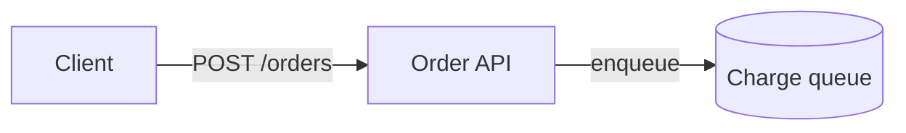
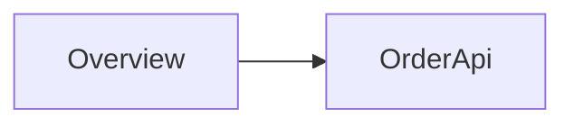
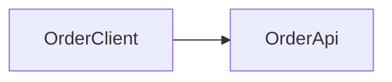
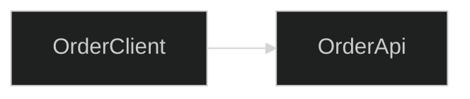

# Visser source format (visser/1)

Read this guide before you write or edit a Visser source file. It states the
rules that `visser check` enforces. Each rule has a valid snippet and an
invalid snippet with the diagnostic code that the invalid snippet produces.
The contract tests compile every snippet in this file.

A snippet without frontmatter is part of a document that starts with valid
frontmatter and an `overview` heading. Run `visser check DOC` after each edit.

## 1. Frontmatter

The file starts with YAML frontmatter between two `---` lines. The required
keys are `format`, `docId`, `title`, `kind`, `capturedAt`, and `visibility`.
The optional keys are `reader` and `retiredTargets`. Any other key is an error.

- `format` is `visser/1`.
- `kind` is `architecture`, `plan`, `root-cause`, `teaching`, `decision`, or `reference`.
- `capturedAt` is an explicit timestamp, such as `2026-09-27T00:00:00Z`.
- `visibility` is `private` or `public`.
- `docId` is a lowercase UUIDv4. Do not write it by hand. Run
  `visser init PATH --kind KIND --title TITLE` to create a document, and never
  change the `docId` of an existing document. Use `visser fork` for a copy.

```markdown visser-valid
---
format: visser/1
docId: 4f8ac70c-7e14-4f06-9865-e194f57c7239
title: A full queue blocks producers
kind: teaching
capturedAt: 2026-09-27T00:00:00Z
reader:
  profile: experienced-systems-engineer
  knows: [threads, queues]
visibility: private
---

<!-- vs:id intro -->
# A full queue blocks producers
```

A missing required key, an unknown key, or a bad value is `E_SYNTAX`:

```markdown visser-invalid E_SYNTAX
---
format: visser/1
docId: 4f8ac70c-7e14-4f06-9865-e194f57c7239
title: A full queue blocks producers
kind: tutorial
capturedAt: 2026-09-27T00:00:00Z
visibility: private
---

<!-- vs:id intro -->
# A full queue blocks producers
```

```markdown visser-invalid E_SYNTAX
---
format: visser/1
docId: 4F8AC70C-7E14-4F06-9865-E194F57C7239
title: A full queue blocks producers
kind: teaching
capturedAt: 2026-09-27T00:00:00Z
visibility: private
---

<!-- vs:id intro -->
# A full queue blocks producers
```

## 2. Target IDs

A target ID matches `^[a-z][a-z0-9_-]{0,63}$`: a lowercase ASCII letter, then
up to 63 lowercase letters, digits, `_`, or `-`. IDs are unique in the whole
document. Choose a readable ID (`p_capacity`) or let `visser ids assign` make
a random one (`b_7tmj7g2h7p9xq4c8`). Keep an ID when its text changes.

```markdown visser-valid
<!-- vs:id p_capacity -->
The queue holds at most eight items.
```

```markdown visser-invalid E_ID_DUPLICATE
<!-- vs:id p_capacity -->
The queue holds at most eight items.

<!-- vs:id p_capacity -->
A full queue makes the producer wait.
```

An ID that is not in the grammar is `E_SYNTAX`:

```markdown visser-invalid E_SYNTAX

A producer waits while the queue is full.

```

## 3. ID markers

Every top-level heading, paragraph, list, table, blockquote, code fence, and
standalone image needs an ID marker. A marker is one whole line:
`<!-- vs:id ID -->`, with at most three leading spaces. The block follows on
the next line. `visser ids assign` adds missing markers.

A block without a marker is `E_ID_MISSING`:

```markdown visser-invalid E_ID_MISSING
The queue holds at most eight items.
```

A marker must follow a blank line (or the frontmatter). Without the blank line,
Markdoc joins the marker to the paragraph above it:

```markdown visser-invalid E_SYNTAX
<!-- vs:id p_one -->
The queue holds at most eight items.
<!-- vs:id p_two -->
A full queue makes the producer wait.
```

A malformed marker is `E_SYNTAX`. Examples: an uppercase ID, text after `-->`,
or a marker on two lines.

```markdown visser-invalid E_SYNTAX
<!-- vs:id P_One -->
The queue holds at most eight items.
```

Put nothing between the marker and its block. Another comment or marker there
is `E_SYNTAX`:

```markdown visser-invalid E_SYNTAX
<!-- vs:id p_one -->
<!-- reviewed -->
The queue holds at most eight items.
```

Markers are allowed only at the top level. A marker inside a list, a
blockquote, or a tag body is `E_SYNTAX`. A list, a table, or a blockquote is one
target. To address part of a tag body, use a `detail` child with its own `id`.

```markdown visser-valid
<!-- vs:id steps -->
- The producer calls `put`.
- The queue stores the item.
```

```markdown visser-invalid E_SYNTAX
<!-- vs:id steps -->
- The producer calls `put`.

  <!-- vs:id step_two -->
  The queue stores the item.
```

Block tags take their ID from the `id` attribute, not from a marker. A marker
before a tag is `E_SYNTAX`:

```markdown visser-invalid E_SYNTAX
<!-- vs:id d_wait -->

A producer waits while the queue is full.

```

A horizontal rule is not addressable. It needs no marker, and a marker before it
is `E_SYNTAX`.

```markdown visser-valid
<!-- vs:id p_before -->
The first part ends here.

---

<!-- vs:id p_after -->
The second part starts here.
```

```markdown visser-invalid E_SYNTAX
<!-- vs:id rule -->
---
```

An ordinary comment is allowed. It must stand alone, with blank lines around it.
The reader never sees it.

## 4. Markdown rules

Use ATX (`#`) headings only. A setext underline (`===` or `---` under text) is
`E_SYNTAX`.

```markdown visser-valid
<!-- vs:id h_limits -->
## Limits
```

```markdown visser-invalid E_SYNTAX
<!-- vs:id h_limits -->
Limits
======
```

Write code in fences only. Markdoc disables indented code blocks, so indented
text becomes a paragraph. A fence is a raw leaf: the build shows its text as
written, including tags, ``, and HTML.

````markdown visser-valid
<!-- vs:id c_example -->
```markdown

<div onclick="x()">shown as text</div>
```
````

Raw HTML outside fences and inline code is `E_UNSAFE_CONTENT`. Use Markdown or
a catalogue tag instead.

```markdown visser-valid
<!-- vs:id p_html -->
The page never contains `<span>` elements from the source.
```

```markdown visser-invalid E_UNSAFE_CONTENT
<!-- vs:id p_html -->
The queue is <span class="warn">full</span>.
```

Variables, functions, and the Markdoc `if`, `else`, `partial`, and `slot` tags
are `E_UNSAFE_CONTENT`. Write literal text and literal attribute values.

```markdown visser-invalid E_UNSAFE_CONTENT
<!-- vs:id p_var -->
The capacity is .
```

```markdown visser-invalid E_UNSAFE_CONTENT

A producer waits while the queue is full.

```

```markdown visser-invalid E_UNSAFE_CONTENT

The queue holds at most eight items.

```

An unknown tag is `E_SYNTAX`:

```markdown visser-invalid E_SYNTAX

A producer waits while the queue is full.

```

## 5. Tag layout

A block tag opens on its own line and closes on its own line. The whole opening,
with all its attributes, fits on one line. Do not let a formatter wrap it.

```markdown visser-valid

A producer waits while the queue is full.

```

```markdown visser-invalid E_SYNTAX

A producer waits while the queue is full.

```

```markdown visser-invalid E_SYNTAX
<!-- vs:id p_inline -->
Text body
```

A block tag without `id` is `E_ID_MISSING`:

```markdown visser-invalid E_ID_MISSING

A producer waits while the queue is full.

```

The inline tags `term`, `cite`, `focus`, and `detail-link` go inside prose. On
a line of their own they are `E_SYNTAX`:

```markdown visser-invalid E_SYNTAX

```

A missing required attribute, an unknown attribute, or a value of the wrong type
is `E_SYNTAX`.

## 6. Primitive tags

| Tag | Required | Optional | Meaning |
|---|---|---|---|
| `detail` | `id`, `label` | `summary` | Referenceable detail. Top level, or inside a component, entity, `definition`, or `detail`. |
| `definition` | `id`, `term` | `aliases` (string array), `auto` (boolean, default `true`) | A definition. The first sentence is the short form. Top level only. |
| `term` | `ref` (a `definition`) | | Inline use of a defined term. |
| `cite` | `ref` (a `source`) | `note` | Inline citation. `note` states what the source supports. |
| `focus` | `targets` (ID array) | | Inline text that highlights targets. |
| `detail-link` | `ref` (a `detail`) | | Inline link to a detail. |

`definition` and `source` render in their own place, not where you write them.
A reference to an unknown ID, or to a target of the wrong tag, is
`E_REF_BROKEN`.

```markdown visser-valid

Backpressure makes a producer wait instead of storing unlimited work.



A producer waits while the queue is full.


<!-- vs:id p_uses -->
This is backpressure. See the
waiting rule and the
two related parts.
```

```markdown visser-invalid E_REF_BROKEN

A producer waits while the queue is full.


<!-- vs:id p_uses -->
This is backpressure.
```

The build links each use of a term to its definition. The match ignores case
and uses whole words only. It does not look in headings, code, links, or the
term's own definition. Add `aliases` for plurals and short forms. Set
`auto=false` to turn the link off for one definition, and tag each use by
hand with `term`. Use `term` also for a different phrasing, such as "the
producer's wait".

```markdown visser-valid

A reference packet names one target by document ID and target ID.



A state is one resolver answer for a packet.


<!-- vs:id p_packets -->
An agent sends a reference packet with each edit. The packet stays the same
when the document changes, so its state
can change.
```

```markdown visser-invalid E_REF_BROKEN
<!-- vs:id p_claim -->
The producer waits. 
```

```markdown visser-invalid E_SYNTAX
<!-- vs:id p_focus -->
Look at the heading.
```

```markdown visser-invalid E_SYNTAX

A producer waits while the queue is full.

```

## 7. Source tags

A `source` tag records evidence. Required: `id`, `kind`, `title`. Optional:
`language`, `asset`, `excerptSha256`, `repository`, `commit`, `baseCommit`,
`file`, `start`, `end`, `symbol`, `url`, `capturedAt`, `originFileSha256`,
`availability` (`captured`, the default, or `link-only`). Any other attribute
is `E_SYNTAX`.

Evidence is provenance, not explanation. Put the mechanism, invariant,
constraint, contrast, failure behavior, or consequence in the owning part's
body or nested `detail`. Use `evidence` to show why that content is credible.
A sources-only drill-down is useful when the reader's next question is “where
did this come from?”, but `W_DETAIL_VALUE` warns when it dominates a figure.

Each `kind` needs more attributes:

| `kind` | Also required |
|---|---|
| `git` | `repository`, `commit` (full 40 or 64 hex characters), `file`, `start`, `end` |
| `working-tree` | `file`, `capturedAt` |
| `web` | `url`, `capturedAt` |
| `file` | `file`, `capturedAt` |
| `supplied` | `capturedAt` |
| `example` | nothing more; the content is illustrative |

Use `visser capture git` or `visser capture file` to write source tags. The
capture command copies the exact text and computes `excerptSha256`. Never type
or edit `excerptSha256` by hand, and never edit the captured body. To change the
excerpt, capture again with `--recapture`.

A captured source has exactly one body: one fence, or an `asset` path. The
`excerptSha256` must match that body.

````markdown visser-valid

```python
print('hi')
```


<!-- vs:id p_claim -->
The program prints one line. 
````

````markdown visser-invalid E_EVIDENCE_HASH

```python
print('hello')
```

````

A captured source without `excerptSha256` is also `E_EVIDENCE_HASH`.

A `link-only` source has no body and no `excerptSha256`, and it needs an
`http` or `https` `url`. It is not self-contained evidence.

```markdown visser-valid

```

A missing attribute for the kind is `E_SYNTAX`:

```markdown visser-invalid E_SYNTAX

```

A body on a link-only source, or a `commit` that is not a full commit ID, is
`E_SEMANTIC`:

````markdown visser-invalid E_SEMANTIC

```text
Condition objects
```

````

## Native graph emphasis

Supported native graph parts accept optional `emphasis="teal|violet|amber"`.
The values share one meaning: draw attention to this part. They do not encode
role, status, evidence basis, or importance levels. Omission is valid. The
supported pairs are `node`/`edge`, `state`/`transition`, `factor`/`causal-link`,
`task`/`dependency`, `stage`/`conversion`, and `concept`/`relation`. Groups
and trace parts do not accept this attribute. See
[visual language](visual-language.md) before using it.

```markdown visser-valid





```

The same part accepts `amber`. An omitted attribute keeps the part neutral.
An arbitrary colour is `E_SYNTAX`:

```markdown visser-invalid E_SYNTAX





```

## 8. Mermaid figures

A `mermaid` tag needs `id`, `title`, and `question`. Its body is optional
interpretation paragraphs and exactly one fence with the language `mermaid`.
Anything else in the body is `E_SYNTAX`.

````markdown visser-valid

The client waits only for the API.



````

````markdown visser-invalid E_SYNTAX

```text
flowchart LR
  OrderClient --> OrderApi
```

````

The build maps each flowchart node and subgraph, state, and sequence participant
name to a target ID: ASCII letters to lowercase, and `.` to `_`. A name that
does not map to a valid ID is `E_SEMANTIC`. A name that maps to an ID that
another target uses, in this figure or anywhere in the document, is
`E_ID_DUPLICATE`. Use distinctive names (`orders_api`, not `api`). Give an edge
an ID (`e1@-->`) to make it referenceable. A reference to a target inside a
Mermaid figure edits the whole figure.

````markdown visser-invalid E_ID_DUPLICATE



````

The toolkit sets all Mermaid configuration. These are `E_UNSAFE_CONTENT`:
`%%{` directives; frontmatter (`---`) in the fence; `click`, `href`, `call`,
`callback`, `link`, and `links` statements; HTML in labels other than `<br>`;
`url(`; the `img:` and `icon:` shape attributes; and `classDef`, `style`, or
`linkStyle` declarations other than `fill`, `stroke`, `stroke-width`,
`stroke-dasharray`, `color`, `font-weight`, and `font-style` with literal values.
A `%%` comment must be on its own line; `%%` later in a line (outside
quotes) is `E_UNSAFE_CONTENT`. An entity code such as `#quot;` is `E_SEMANTIC`; write the character. Composite
states (`state X { … }`) are `E_SEMANTIC`; split the diagram.

````markdown visser-invalid E_UNSAFE_CONTENT



````

````markdown visser-invalid E_UNSAFE_CONTENT



````

````markdown visser-invalid E_UNSAFE_CONTENT

```mermaid
flowchart LR
  OrderClient --> OrderApi %% the API host
```

````

## Extension components

Use an extension only when the catalogue cannot answer the question. An
extension is executable code: never install or trust one without the user's
authorization. Run `extension inspect DIR|DIGEST` to read its manifest, schema,
and guide without running it, and follow its `GUIDE.md`. The document's lock
must pin the extension (`extension pin DOC DIGEST`).

```markdown


Body text.


```

Each `part` is a target and needs its own ID. A `part` outside an `extension`
is `E_SYNTAX`. Extra attributes must match the extension's schema. A missing or
unpinned extension is `E_EXTENSION_MISSING`; an untrusted one is
`E_EXTENSION_UNTRUSTED`.

## 9. Retired targets

To remove a target that other documents can refer to, use `visser refs retire`.
It writes a `retiredTargets` entry. An ID that is both live and retired is
`E_SEMANTIC`:

```markdown visser-invalid E_SEMANTIC
---
format: visser/1
docId: 4f8ac70c-7e14-4f06-9865-e194f57c7239
title: A full queue blocks producers
kind: teaching
capturedAt: 2026-09-27T00:00:00Z
visibility: private
retiredTargets:
  intro:
    reason: merged into the summary
---

<!-- vs:id intro -->
# A full queue blocks producers
```

## 10. Diagnostics and fixes

| Code | Cause | Fix |
|---|---|---|
| `E_SYNTAX` | Bad frontmatter, marker, tag layout, attribute, or heading. | Read the message and the line. Correct the source as this guide shows. |
| `E_ID_MISSING` | A top-level block has no marker, or a block tag has no `id`. | Run `visser ids assign`, or add an `id` attribute. |
| `E_ID_DUPLICATE` | Two targets have the same ID, or a Mermaid name maps to a used ID. | Rename the new target. Never rename an ID that readers use. |
| `E_UNSAFE_CONTENT` | Raw HTML, a variable, a function, `if` or `partial`, unsafe Mermaid content, or a repository URL with credentials. | Remove it. Put example code in a fence. |
| `E_SEMANTIC` | The content breaks a family rule (for example a cycle, a live and retired ID, or a link-only source with a body). | Change the content to meet the rule in the message. |
| `E_REF_BROKEN` | A reference names an unknown ID or a target of the wrong tag, or a declared file is missing. | Point the reference at an existing target of the correct tag. |
| `E_EVIDENCE_HASH` | The captured body does not match `excerptSha256`, or the hash is missing. | Capture again with `visser capture … --recapture`. Do not edit the hash. |
| `E_SPAN_UNPROVEN` | The parser cannot prove the byte range of a target. | Keep each marker, tag opening, and tag closing on its own line, then run `visser check` again. If the error stays, report it. |

On `E_SYNTAX` or `E_SPAN_UNPROVEN`, fix the source. Do not remove content to
silence a diagnostic.
